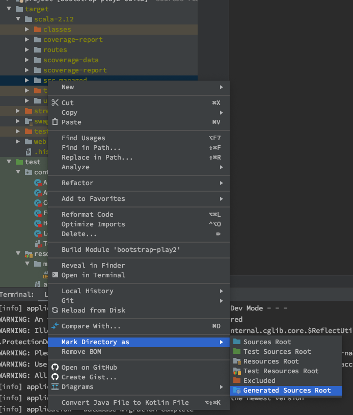

# Quickstart Developers Guide
###### Last Updated: 18.06.2020

## How to add a new data:

### Prerequsites:

 - Docker installed
 - Firebase service account json file added to __./conf/firebase.json__
 - Sbt and Java 11 installed
 
### Description:

1. Create a new file named V2__NameForThisFile.sql or edit V1__Tables.sql in __./conf/db/migration/*__ and add PostgreSQL Statements for the new data structure.

2. Create new Class with Companion Object for the new Model in _/app/models/api_ and extend from [ApiBaseModel](../app/de/innfactory/bootstrapplay2/models/api/ApiBaseModel.scala) and implement needed Methods like toJson for the newly created model as shown in the example models.

3. Start a new Database, migrate with flyway and start slick codegen (See [Readme](../README.md) for commands). In intelliJ mark the __./scala-x.xx/src_managed__ as generated source root through right clicking and mark as source root.   

4. Create a new [DAO](./DaoDoc.md) in __./app/db/*__ extending from [BaseSlickDAO](../app/de/innfactory/bootstrapplay2/common/daos/BaseSlickDAO.scala). See the example DAOs for usage. 

5. Bind the newly created DAO to the Trait for Dependency Injection in [Module](../app/Module.scala). A new Class Called ***DAOCloseHook has to be created and also bound to close the Database connection on application stop or restart (important for hot reload).

   ```
    bind(classOf[MyNewDAO]).to(classOf[SlickMyNewSlickDAO])
    bind(classOf[MyNewDAOCloseHook]).asEagerSingleton()
   ```

6. Create a new [Repository](./RepositoryDoc.md) __./app/de.innfactory.bootstrapplay2.repositories/*__ for data aggregation and handling. 

7. A new [Controller](./ControllerDoc.md) has to be created in __./app/controllers/*__.

8. Bind the route to the Controller Method in [routes](../conf/routes) (/conf/routes).  
   The first entry is the HTTP Method (GET, POST, PATCH, DELETE, ...).  
   The second entry is the method path excluding the domain. In Path Parameter can be added like shown in the example below with :parameterName and then bound to the Method with the same name and data type. 
   The third entry calls the controller method with controllerpackage.ControllerName.MethodName(id: DataType). Additional Query Parameter can be added by adding more parameters to the Method (Option[Datatype] or Datatype) for optional or required query parameters.
  
     ```
       GET       /v1/test/:id          controllers.TestController.test(id: String)
      ```
   
9. Add Swagger Description above route. [iheartradio/play-swagger](https://github.com/iheartradio/play-swagger) 
 
    ```
      summary: MethodName
      tags:
        - mydefinedtag
      responses:
         '200':
           description: Response
    ```

    Models can be referenced after being defined in [build.sbt](../build.sbt).
    ```
     responses:
          '200':
          description: success
           schema:
             $ref: '#/components/schemas/de.innfactory.bootstrapplay2.models.api.Company'
    ```
10. To create Tests add a new ControllerTest to __./test/controllers/*__. Test Data can be added to the Database by editing the [V999__DATA.sql](../test/resources/migration/V999__DATA.sql) in __./test/resources/migration/*__. Flyway will then automatically migrate the data into the database before each Controller Test. So each controller starts with a freshly cleaned an migrated Database.

11. Run test with the runForScript. Make sure no Docker database container is running with the port bound to 5432!  

      ```
        ./.deployment/runFor.sh
       ``` 

12. The test coverage can be found in __./target/scala-x.xx/scoverage-report/__. Just open the **index.html** file in the browser of your choice.

